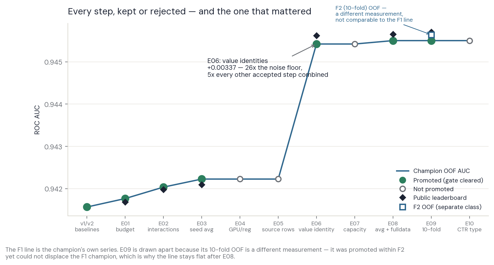
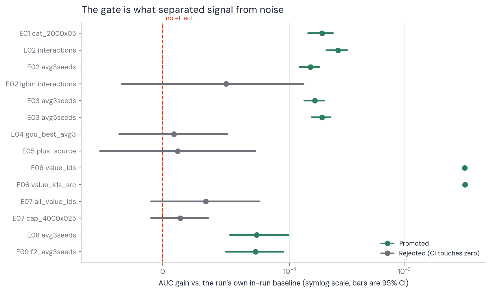
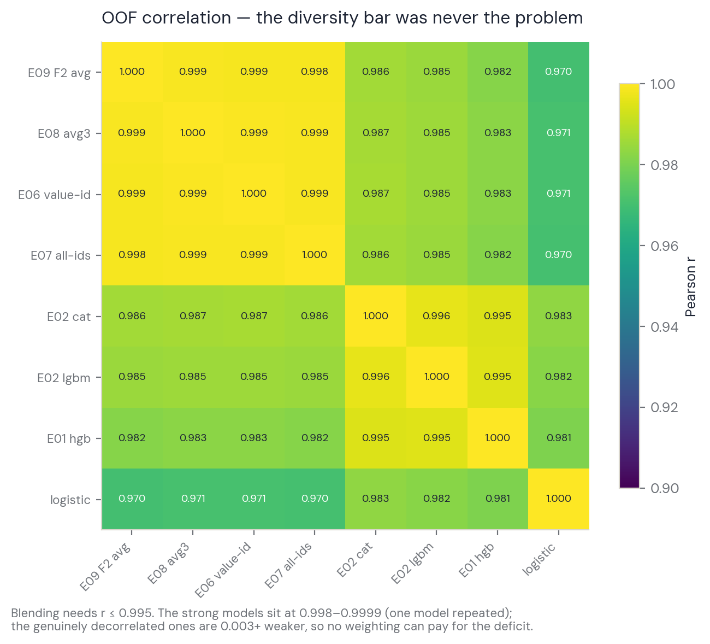
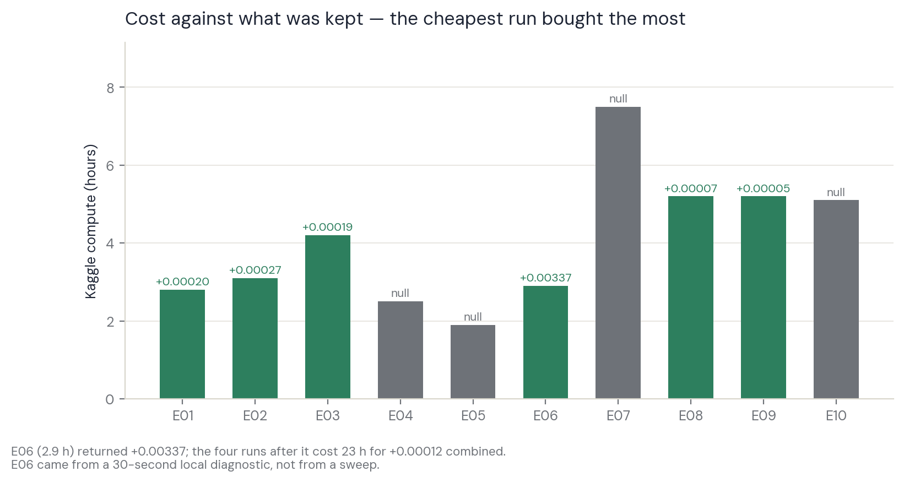

# Model Comparison — the visual record

The four figures below are the ledger at a glance. **The ledger
(`docs/4_experiment_ledger.md`) stays canonical** for every number,
predeclaration and gate result; this doc adds no facts of its own, it
only draws them. Regenerate with `python3 scripts/make_figures.py`
(reads the saved OOF matrices; refits nothing).

## What was run, and why

Each row is one experiment: the hypothesis it was designed to falsify,
what happened, and what that closed. Every gate was predeclared *before*
the run — the commits prove the ordering.

| # | Hypothesis under test | Outcome | What it settled |
| --- | --- | --- | --- |
| v1/v2 | Sensible defaults beat a constant | 0.94157 | Established the floor; CatBoost ahead of LightGBM/HGB |
| E01 | A matched boosting budget closes the family gap | **+0.00020, promoted** | Capacity tuned; LightGBM does not catch up |
| E02 | The subsidy gate deserves explicit crosses | **+0.00027, promoted** | Best pre-E06 step; replicated across families |
| E03 | Feature gain and seed averaging are additive | **+0.00019, promoted** | Additive, exactly as predicted (0.94220 called, 0.94220 delivered) |
| E04 | GPU is a cheap way to search; regularisation helps | **null** | GPU is 0.00070 *worse* and not reproducible → screening only |
| E05 | The CC0 source dataset adds training signal | **null (+0.00001)** | Extra rows closed; the dataset survives only as a feature |
| E06 | **Exact numeric values are identities the model cannot see** | **+0.00337, promoted** | The one that mattered — 26× the noise floor |
| E07 | Post-E06, capacity/encoding/CTR-complexity reopen | **null** | Model is saturated on configuration |
| E08 | Averaging still pays; a full-data refit helps at test time | **+0.00007 / +0.00004** | Averaging does *not* transfer; corrected the LB>OOF story |
| E09 | 10 folds beat 5 (more data per model, more models averaged) | **+0.00005 LB** | F2 adopted for new work; best public score |
| E10 | The CTR *estimator* has headroom | **degenerate** | Two arms were algebraically identical — axis closed |
| R1 | The champion reproduces from the current notebook | **bit-identical** | Eight vectors and the artifact hash match exactly |

Free screens that never needed a kernel run — train/test duplicates, an
`id` signal, joint value identities, a decorrelated LightGBM partner,
artifact blending, and stacking — are recorded in the ledger. All null.

## The sequence

Nine steps moved the champion by +0.00066 combined. One moved it by
+0.00337. E06 came from a 30-second check on column cardinality, not
from a sweep — which is the single most transferable lesson here.

Note that E09 sits **off** the line deliberately: its 10-fold OOF is a
different measurement class, and the project refuses cross-class
comparisons in code, so the figure refuses one too.

## Which differences were real

Every candidate's gain with its 95% CI. Promotion required a majority of
folds, a CI entirely above zero, **and** P(Δ>0) ≥ 0.95 — so the rejected
bars are the ones whose intervals touch the dashed line, regardless of a
positive point estimate. `e07_all_value_ids` reached P = 0.954 and was
still refused on the CI: with two gates at 95% in one run, a lone P
grazing the threshold is exactly what multiple comparisons manufacture.

## Why nothing could be blended

The project's diversity bar allows a blend only at r ≤ 0.995. The strong
candidates sit at 0.998–0.9999 — one model repeated — while the models
that *are* decorrelated are 0.003+ weaker, a deficit no weighting can
pay for. Blending, and later stacking, were both measured and closed;
the bar turned out to be necessary but not sufficient.

## What the compute bought

E06 cost 2.9 h and returned +0.00337. The four experiments after it cost
23 h for +0.00012 combined. That is the shape of a search hitting its
ceiling, and it is why the project stopped rather than buying more runs.
